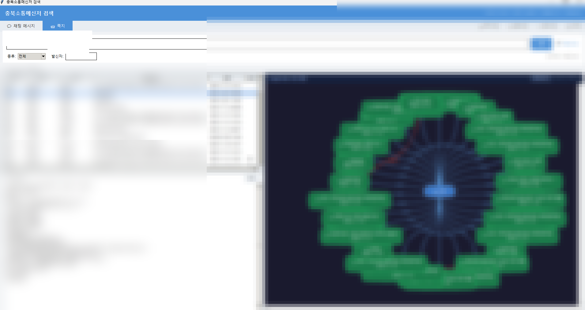
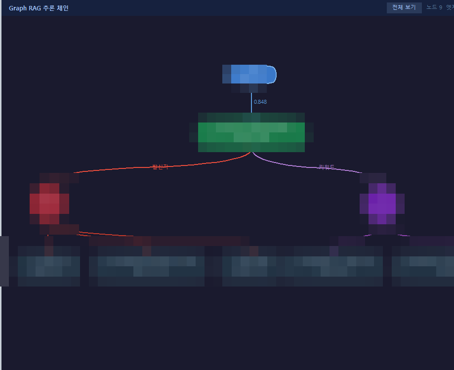

# 충북소통메신저 RAG 검색 앱

충북소통메신저(웹 메신저)의 쪽지·채팅 메시지를 로컬에서 수집하고,
**Hybrid RAG**(키워드 + 로컬 임베딩 시맨틱 검색) + **Graph RAG** 시각화로 검색하는 Windows 데스크톱 앱입니다.

> **License:** CC BY-NC 4.0 — 출처 병기 필수, 상업적 이용 금지

---

## 스크린샷

| 전체 화면 (쪽지 검색 + Graph RAG) | Graph RAG 추론 체인 |
|---|---|
|  |  |

---

## 주요 기능

| 기능 | 설명 |
|---|---|
| 📥 쪽지·메시지 수집 | Chrome DevTools Protocol(CDP)로 메신저 데이터 자동 수집 |
| 🔍 키워드 검색 | SQLite 기반 빠른 키워드 검색 |
| 🧠 로컬 RAG 검색 | `intfloat/multilingual-e5-small` 임베딩 모델로 의미 기반 검색 (CPU 전용) |
| 🕸 Graph RAG 시각화 | 쿼리→쪽지→발신자→키워드 hop 추론 체인을 인터랙티브 그래프로 표시 |
| 📎 첨부파일 수집 | 쪽지 첨부파일 일괄 다운로드 |
| 🔄 인덱스 재빌드 | 수집 후 임베딩 인덱스 자동 갱신 |

---

## 기술 스택

| 구성 요소 | 내용 |
|---|---|
| **임베딩 모델** | `intfloat/multilingual-e5-small` (117MB, CPU 전용, 384차원) |
| **검색 방식** | Hybrid RAG: 키워드(SQLite LIKE) + 시맨틱(코사인 유사도) |
| **Graph RAG** | 쿼리→쪽지→인물/키워드→연관쪽지 3-hop 추론, tkinter Canvas 시각화 |
| **데이터 수집** | Chrome DevTools Protocol (CDP) WebSocket |
| **GUI** | tkinter (Windows 네이티브) |
| **DB** | SQLite |

---

## 설치 방법 (초보자 기준)

### 1단계 — Python 설치

1. [python.org](https://www.python.org/downloads/) 접속
2. **Python 3.10 이상** 다운로드 후 설치
3. 설치 시 **"Add Python to PATH"** 반드시 체크 ✅

### 2단계 — 코드 다운로드

**방법 A: ZIP 다운로드 (Git 없는 경우)**
1. 이 페이지 상단 초록색 `Code` 버튼 클릭
2. `Download ZIP` 클릭 후 압축 해제

**방법 B: Git 사용**
```bash
git clone https://github.com/jkf87/messenger-rag.git
cd messenger-rag
```

### 3단계 — 패키지 설치

명령 프롬프트(cmd)를 열고 프로젝트 폴더로 이동 후 실행:

```bash
pip install -r requirements.txt
```

> 처음 실행 시 `intfloat/multilingual-e5-small` 모델(117MB)이 자동 다운로드됩니다.
> 학교 네트워크(SSL 프록시)에서는 자동으로 우회 처리됩니다.

### 4단계 — Chrome 원격 디버깅 설정

메신저 데이터를 수집하려면 Chrome을 원격 디버깅 모드로 실행해야 합니다.

**Chrome 바로가기 속성에서 대상(Target) 수정:**
```
"C:\Program Files\Google\Chrome\Application\chrome.exe" --remote-debugging-port=9000
```

또는 `1_백업_실행.bat` 파일을 더블클릭하면 자동으로 설정됩니다.

### 5단계 — 앱 실행

```bash
python search_app_win.py
```

또는 `2_검색앱_실행.bat` 더블클릭

---

## 사용 방법

### 데이터 수집 (최초 1회)

앱 상단 탭 바 오른쪽 버튼들을 순서대로 클릭:

1. **📥 쪽지수집** — 쪽지 목록 수집 (메신저 로그인 상태 필요)
2. **📄 본문수집** — 쪽지 전체 내용 수집
3. **📎 첨부수집** — 첨부파일 다운로드
4. **🔄 인덱스** — RAG 임베딩 인덱스 생성 (첫 실행 약 1분 소요)

### 검색

- **💬 채팅 메시지** / **📨 쪽지** 탭 선택
- 검색어 입력 후 Enter 또는 검색 버튼
- **로컬 RAG 체크박스** 활성화 시 의미 기반 검색

### Graph RAG

- 쪽지 탭에서 결과 클릭 → 우측 패널에 hop 추론 그래프 자동 표시
- **전체 보기** 버튼 → 검색 결과 전체를 방사형 그래프로 표시
- 노드 드래그로 위치 재배치 가능
- 노드 hover 시 상세 정보 툴팁

---

## 폴더 구조

```
messenger-rag/
├── search_app_win.py      # 메인 GUI 앱
├── local_rag.py           # 로컬 RAG 검색 모듈
├── graph_rag.py           # Graph RAG 추론 체인 생성
├── graph_canvas.py        # 그래프 시각화 위젯 (tkinter Canvas)
├── build_index.py         # 임베딩 인덱스 빌드
├── backup_notes.py        # 쪽지 수집
├── fetch_full_content.py  # 쪽지 본문 전체 수집
├── batch_download.py      # 첨부파일 일괄 다운로드
├── convert_hwp_to_hwpx.py # HWP → HWPX 변환 (한글 설치 필요)
├── requirements.txt
├── LICENSE                # CC BY-NC 4.0
└── docs/
    ├── screenshot_full.png
    └── screenshot_graph.png
```

---

## 주의사항

- **Windows 전용** (tkinter + pyhwpx COM 자동화)
- 수집된 데이터(`messages.db`, `embed_index.pkl`, `attachments/`)는 `.gitignore`로 제외됩니다 — 절대 공유하지 마세요
- 메신저 서버 및 학교 네트워크 환경에 맞게 CDP URL(`127.0.0.1:9000`)을 설정하세요

---

## License

[CC BY-NC 4.0](LICENSE) — 저작자표시·비영리
Copyright (c) 2026 jkf87
